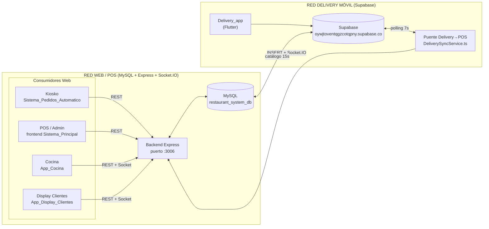
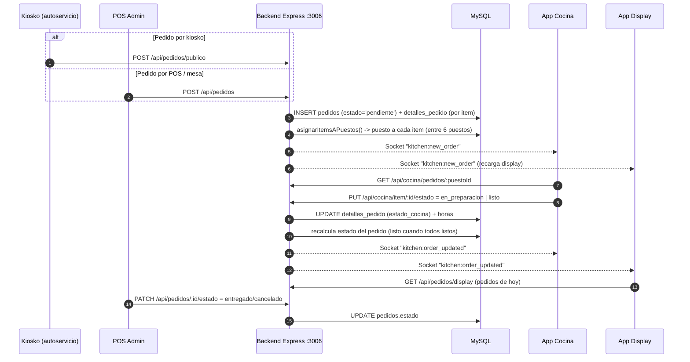

# ARQUITECTURA DEL SISTEMA — Restaurante Paccioli POS

> Diagrama y flujo funcional del sistema **completo**: desde que se crea un pedido
> hasta que se entrega/completa, pasando por todos los subsistemas.

---

## 1. Vista general

El sistema está formado por **5 subsistemas** repartidos en **2 redes independientes**.

**Puntos clave:**
- Los 4 sistemas web comparten **la misma base MySQL** a través del **único** backend Express (`:3006`), que además sirve **Socket.IO** para el tiempo real.
- La **Delivery_app (Flutter)** usa su **propia** cuenta de Supabase, pero ya **no es aislada**: un **puente** (`DeliverySyncService.ts`) copia sus pedidos al MySQL y **emite** los mismos eventos Socket.IO (`kitchen:new_order`, `pedidos:changed`, `delivery:changed`) para que cocina, display y POS admin los vean en tiempo real.
- El **catálogo es bidireccional-lógico**: `CatalogoSyncService.ts` empuja los productos del POS (MySQL) hacia la tabla `products` de Supabase cada 15 s (y de forma inmediata al crear/editar un producto en el admin). Los pedidos delivery se vinculan por `products.pos_id`.

---

## 2. Tecnologías y puertos

| Subsistema | Ruta | Tecnología | Función |
|---|---|---|---|
| Backend (hub) | `Sistema_Principal_Administrador/backend` | Express + MySQL2 + Socket.IO + JWT + multer | API REST + WebSocket, puerto **3006** |
| POS admin (frontend) | `Sistema_Principal_Administrador/frontend` | Vite + React + TS + Tailwind | Panel admin (pedidos, inventario, delivery, reportes) |
| Kiosko | `Sistema_Pedidos_Automatico` | Vite + React + TS | Autoservicio: **crea pedidos** |
| Cocina | `App_Cocina` | Vite + React + TS | Cocineros reciben/preparan items por puesto |
| Display clientes | `App_Display_Clientes` | Vite + React + TS | Pantalla de estado de pedidos |
| Delivery móvil | `Delivery_app` | Flutter + Supabase | App de reparto (independiente) |

---

## 3. Flujo del pedido paso a paso (red web / POS)

**Flujo narrativo:**

1. **Creación** — El pedido nace desde el **kiosko** (`POST /api/pedidos/publico`) o desde el **POS admin** (`POST /api/pedidos`). El backend inserta una fila en `pedidos` (estado `pendiente`) y una fila por cada producto en `detalles_pedido` (todo en una transacción).
2. **Reparto a puestos** — `asignarItemsAPuestos()` asigna **cada producto** al **puesto de cocina** de su categoría (columna `categorias.puesto_cocina_id`, 1 categoría → 1 puesto, determinista por menor id). El puesto 6 queda fuera de la asignación automática.
3. **Notificación a cocina** — El backend emite `kitchen:new_order`. `App_Cocina` (abierta en el puesto correspondiente) carga sus pedidos y suena un aviso. El cocinero marca cada item como `en_preparacion` y luego `listo`.
4. **Estado del pedido** — Cada vez que un item cambia, el backend **recalcula** el estado del pedido padre a partir de sus items (todos listo → `listo`, alguno en preparación → `preparando`, etc.) y emite `kitchen:order_updated`.
5. **Display** — `App_Display_Clientes` muestra 3 columnas (Pendientes / En Preparación / Listos). Cuando un pedido queda `listo`, alerta con sonido y se oculta tras 20 seg.
6. **Cierre** — El **POS admin** (o el flujo de delivery web) marca el pedido como `entregado` / `cancelado`.

---

## 4. Estados de los pedidos

### Pedido (`pedidos` — MySQL)
`pendiente` → `preparando` → `listo` → `entregado`
`cancelado` (aplica sin pasar por los anteriores)

### Item de pedido (`detalles_pedido` — MySQL)
`pendiente` → `en_preparacion` → `listo`

### Delivery web (`delivery` — MySQL, gestionado desde POS admin)
`pendiente` → `asignado` → `en_camino` → `entregado` | `cancelado`
> Al marcar el delivery como `entregado`, el backend marca el `pedidos` asociado como `entregado`.

### Delivery móvil (`Delivery_app` — Supabase, integrada)
Estados propios en la BD de Supabase (`pending`, `assigned`, `in_transit`, `delivered`, `cancelled`). El **puente** los traduce a los estados MySQL de `delivery`/`pedidos` (ver `INTEGRACION_DELIVERY_POS.md` → mapeo de estados).

---

## 5. Eventos Socket.IO (`kitchen:*`)

| Evento | Emisor (backend) | Consumidores |
|---|---|---|
| `kitchen:new_order` | `PedidoController.create` (`:170`) | App_Cocina, App_Display_Clientes |
| `kitchen:order_updated` | `CocinaController.cambiarEstadoItem` (`:189`) | App_Cocina, App_Display_Clientes |

> La App Display además recarga por polling cada 10 s como respaldo ante eventos perdidos.

---

## 6. Endpoints REST principales (`/api`)

| Método | Ruta | Controlador | Uso |
|---|---|---|---|
| POST | `/pedidos` | PedidoController.create | Crear pedido (POS) |
| POST | `/pedidos/publico` | PedidoController.create | Crear pedido (kiosko) |
| GET | `/pedidos` | PedidoController.getAll | Listar pedidos |
| GET | `/pedidos/display` | PedidoController.getParaDisplay | Pedidos de hoy (display) |
| PATCH | `/pedidos/:id/estado` | PedidoController.updateEstado | Cambiar estado (POS) |
| GET | `/cocina/puestos` | PuestoController.getAll | Listar puestos (admin/config) |
| GET | `/cocina/pedidos/:puestoId` | CocinaController.getPedidosPorPuesto | Pedidos de un puesto |
| PUT | `/cocina/item/:detalleId/estado` | CocinaController.cambiarEstadoItem | Avanzar item (cocina) |
| POST | `/delivery` | DeliveryController.create | Crear delivery web |
| PATCH | `/delivery/:id/estado` | DeliveryController.updateEstado | Avanzar delivery web |

---

## 7. Esquema PostgreSQL-ish (resumen de datos)

**MySQL `restaurant_system_db`** (red web):
- `usuarios`, `categorias`, `productos`, `inventario`, `movimientos_inventario`, `mesas`, `clientes`,
- `pedidos` y `detalles_pedido` (los 2 del flujo de cocina),
- `delivery` (orden de reparto web),
- `puestos_cocina` (6 puestos) y `categorias.puesto_cocina_id` (qué categoría prepara cada puesto; 1 categoría → 1 puesto).

**Supabase (red delivery móvil)** — espejo funcional propio con su propia BD de pedidos/repartidores/productos, conectado al POS vía el puente (`DeliverySyncService.ts` para pedidos/estados y `CatalogoSyncService.ts` para el catálogo por `products.pos_id`).

---

## 1. Conexiones aparte / brechas detectadas

1. ~~**`Delivery_app` (Flutter) es un sistema aislado.**~~ **RESUELTO (2026-08-20):** el puente `DeliverySyncService.ts` + `CatalogoSyncService.ts` conecta Supabase ↔ MySQL/Express. Los pedidos de la app aparecen en cocina, display y POS admin en tiempo real; el catálogo del POS se refleja en la app.
2. **`updateEstado` del POS no emite Socket.IO** (`PedidoController.ts`): al cambiar un estado a `entregado` no notifica por evento (aunque el display igual recarga por polling).
3. **`App_Cocina` usa `cocineroId: 1` fijo** (`App.tsx:68`): asume el primer usuario como cocinero; puede ser un bug con varios usuarios.
4. **Endpoint público reutiliza `create` del POS** (`/pedidos/publico`): expone las mismas validaciones que el uso interno.

---

*Documento generado a partir del análisis del código fuente de los 5 subsistemas.*